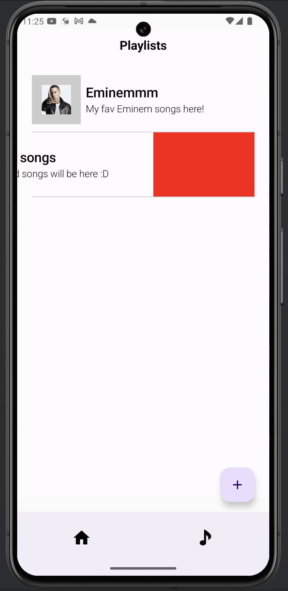

### App Report

## Summary of Functionalities

# Music Features:

Search Screen: Users can search for albums, tracks, and playlists.

Playlist Management: Create, view, and delete playlists. Add and remove tracks from playlists.

Playlist Details: Displays song information within playlists.

Album Details: Provides detailed information about selected albums.

Track Details: Displays information about tracks with an option to add them to favorites.

# Quiz Features:

Add Questions: Allows users to add quiz questions.

Quiz Game: Engage in quizzes with interactive gameplay.

Quiz List Management: Preview, list, and remove quizzes.

# Illustrative Screenshots:

# Technical Section

App Architecture

The application follows the MVVM (Model-View-ViewModel) architecture pattern, ensuring a clear separation of concerns and making the app modular, testable, and scalable.

Architectural Overview:

Model: Handles data operations, including local database interactions and API calls. This layer includes:

Local: Room database entities and DAOs.

Network: Retrofit client for API calls and response models.

ViewModel: Acts as a bridge between the Model and View, holding UI-related data and logic.

View: UI components built using Jetpack Compose and Fragments.

Diagram:

[View] ➔ [ViewModel] ➔ [Repository] ➔ [Local/Remote Data Source]

# Implementation Choices

Jetpack Compose: Simplifies UI development with a declarative approach (Included RecyclerView as demo, as with a mandatory requirement)

Room Database: For efficient and abstracted local data storage.

Retrofit: To handle API communication seamlessly.

Compose Navigation Component: Ensures smooth transitions between screens and robust handling of configuration changes.

# Directory Structure

> data

local: Contains Room database setup, including entities and DAOs.
dao: Interfaces defining database operations
entity: Data classes representing database tables
AppDatabase: Singleton providing the database instance
network: Manages API interactions using Retrofit
api: Defines API endpoints
model: Response models organized into sub-packages (e.g., detail, search)

> data_models - Holds reusable data models shared across the app.

> media - Contains media-related utilities and components.

> navigation - Centralized navigation setup using the Navigation Component, ensuring seamless transitions and configuration resilience.

> presentation

components: Reusable UI components categorized into sub-folders like button, content, and loading.
screens: Contains UI screens for different features, such as:
add_question_screen: Handles adding quiz questions.
album_detail_screen: Displays album details.
home_screen: The app’s main screen.
and etc.

# Pair Contributions

Zakariya:
Search screen.
Playlist screen list/add/remove.
Playlist detail screen with song information.
Track detail screen add to favorites.
Navigation, robust configuration changes.

Yariyeva:
Album detail screen.
Track detail screen (almost done).
Quiz add questions screen.
Quiz game screen.
Quiz list/remove/preview.

# How to Run the App

Clone the repository.
Open the project in Android Studio.
Sync the Gradle files.
Run the app on an emulator or connected device.

# Future Improvements

Enhance quiz analytics and scoring system.
Add offline mode for music features.
Optimize app performance and reduce load times.